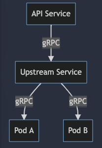

# Cluster Tools
This is a troubleshooting box for validating function of cluster, service mesh, serverless etc.

* gRPC Load Balance (Observing pod ID)
* [B3 Tracing](https://github.com/openzipkin/b3-propagation) : request ID, trace ID, span ID, etc.
* X-Forwarded-For and NAT Egress address
* Websocket
* HPA (Burn Resource, ToDo)
* PV (Generate file, ToDo)
* Circuit breaker (ToDo)
* In container tools like MySQL, Redis and gRPC cli

## Content
* [Deployment](deployment)
* [API](api)
* [In Container Tools](in-container-tools)

## Deployment
We are going to deploy simple microservices, so that we can invoke API to observe upstream traffic.

* kubernetes
  ```shell
  kustomize build ./deployment | kubectl apply -f -
  ```

## API 
### Observe info
* To observe cluster network and the traffic heading to upstream-service
    
---
* Request 
```shell
curl -X GET http://localhost:8080/observe/info
```
* Response
```shell
{
    "xff": "103.0.113.165, 60.91.3.17, 120.192.338.678",
    "egressAddress":"{\"ip\":\"34.134.179.157\",\"country\":\"United States\",\"cc\":\"US\"}",
    "podName":"api-service-54574c67f6-rm7t6",
    "upstream":{
        "podName":"upstream-service-66fb55fdcd-ct686",
        "xRequestID": "c67f6-rm7t6-asfsf-afasfn",
        "traceID": "asfafve-idsfaw-fzfsaf-sefe",
        "spanID": "fa83fcfa"
    }
}
```

### Websocket Ping 
* To ensure websocket goes well
```shell
GET /observe/ws-ping
```
we can make a client easily by javascript
```javascript
            var ws = new WebSocket("ws://localhost:8081/observe/ws-ping");
            ws.onopen = function(evt) {
                console.log("Connection open ...");  
                keepAlive();  
            };
            function keepAlive() {
                var timeout = 10000;  
                if (ws.readyState == ws.OPEN) {  
                    ws.send('ping');  
                }
                timerId = setTimeout(keepAlive, timeout);  
            }
            ws.onmessage = function(evt) {  
                console.log("Received Message: " + evt.data);  
            };
            ws.onclose = function(evt) {  
                console.log("Connection closed.");  
            };
```


## In Container Tools
* mysql-client 
````sh
mysql -hmyhost --port 3306 -uuser -ppassword  --database mydb
````
* redis
````sh
redis-cli -h myhost -p 6379 ping
````

* grpcurl
````sh
grpcurl -plaintext myhost:9090 list
grpcurl -plaintext -rpc-header X-Request-ID:test -plaintext -d '{"ParamOne": "1", "ParamTwo": "1"}' localhost:8081 observe.ObserveService/GetStatus
````

* nc
````sh
nc myhost myport -v -z
````


